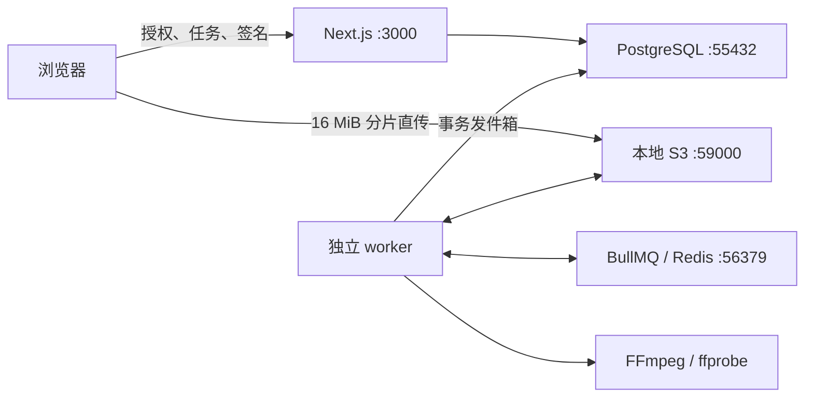

# 运行说明与当前边界

## 本地系统

网页不接收媒体字节，也不运行文件处理。数据库保存任务事实，worker 将 outbox 入队；队列 ID 包含 job ID 和 attempt，重复入队可重试。完成结果使用数据库条件更新，只允许当前尝试、未取消且未过期的任务发布输出。

## 环境配置

所有键见根目录 `.env.example`。根目录 `.env` 和网页 `.env.local` 都被 Git 忽略。更换环境后必须重启网页和 worker；`NEXT_PUBLIC_*` 在生产构建时写入前端。

| 配置                                                    | 用途                                                                                   |
| ------------------------------------------------------- | -------------------------------------------------------------------------------------- |
| `DATABASE_URL`                                          | PostgreSQL 的服务端数据库连接                                                          |
| `REDIS_URL`                                             | Redis / TLS Redis；生产建议独立 Redis，`noeviction`                                    |
| `S3_ENDPOINT`、`S3_REGION`                              | 本地兼容存储或 R2 S3 API，R2 region 通常为 `auto`                                      |
| `S3_ACCESS_KEY_ID`、`S3_SECRET_ACCESS_KEY`、`S3_BUCKET` | 仅服务端与 worker 可访问的对象存储配置                                                 |
| `S3_FORCE_PATH_STYLE`                                   | 本地 MinIO 为 `true`，R2 按实际端点配置                                                |
| `APP_URL`                                               | 可信网页地址、Origin 校验、认证回调目标；不能信任客户端 Host 来构造回调                |
| `SESSION_SECRET`                                        | 至少 32 字符的随机签名密钥；更换会使原匿名会话失效                                     |
| `MAX_UPLOAD_BYTES`                                      | 服务端上传上限，音视频默认 1 GiB，图片/PDF 另限制 50 MiB；提高上限需同步网页并完成压测 |
| `WORKER_CONCURRENCY`、`FFMPEG_THREADS`                  | 默认 1 个任务、2 个编码线程                                                            |
| `JOB_TIMEOUT_MS`、`FILE_TTL_HOURS`                      | 默认 1 小时处理超时、24 小时文件到期                                                   |
| `BETTER_AUTH_URL`、`BETTER_AUTH_SECRET`                 | 认证地址与独立随机密钥，仅服务端使用                                                   |
| `GOOGLE_CLIENT_ID`、`GOOGLE_CLIENT_SECRET`              | Google Web OAuth 凭据                                                                  |
| `AUTH_EMAIL_MODE`、`AUTH_EMAIL_FROM`、`RESEND_API_KEY`  | 本地邮件 / Resend 发信配置                                                             |

`setup:local` 明确拒绝非本地数据库 / 存储端点。它仅创建本地表和私有测试 bucket，不创建任何云资源。迁移 SQL 有版本文件；后续变更新增迁移，不修改已应用版本。本地初始化已使用 schema_migrations 记录和事务锁；生产发布需在受控流程中按顺序执行全部迁移。

### Better Auth

账户、会话、密码哈希和验证记录存储于现有 PostgreSQL，由 Better Auth / Drizzle 管理。新迁移 `0010_better_auth.sql` 单独建表，保留业务历史。所有表启用 RLS，仅服务端数据库角色访问，不向浏览器开放直连策略。

邮箱验证后主动登录；密码重置撤销既有会话。游客任务在服务端事务内归入登录账户，旧游客凭据不能重复领取。Google / Resend 的具体申请项、本地邮件和测试说明见 [认证文档](authentication.md)。

### R2

1. 建立私有 bucket，关闭公共访问；使用只覆盖该 bucket 的服务凭据。
2. 设置 CORS：Origins 为实际网页域名；Methods 为 GET/PUT/HEAD；允许所需上传请求头，ExposeHeaders 包含 ETag。
3. 设置未完成分片上传的生命周期兜底清理。数据库 worker 负责已登记文件的精确到期和主动删除，bucket 生命周期覆盖登记前崩溃留下的孤立分片。
4. 用真实 R2 验证多分片、签名中的 Content-Length、ETag、取消、过期与短时下载。当前验证对象是本地兼容存储，不等同于 R2 云验收。

相关文档：[R2 分片上传](https://developers.cloudflare.com/r2/objects/multipart-objects/)、[预签名 URL](https://developers.cloudflare.com/r2/api/s3/presigned-urls/)、[CORS](https://developers.cloudflare.com/r2/buckets/cors/)。

## 生命周期与恢复

- 文件在**上传开始**时确定 24 小时有效期，任务使用同一到期时间。
- API 在到期后立即拒绝生成新的下载地址；已签发的链接最长有效 15 分钟，真实字节删除由 worker 完成。
- 用户删除任务时立即隐藏该任务并撤销 API 访问；正常情况下 worker 在下一轮约 2 秒内开始物理清理。处理中的任务先取消，随后清理。存储故障时保留清理记录持续重试。
- 删除某个任务不会删掉仍被其他任务使用的输入。压缩输入在最后一个任务删除后清理；已有编辑准备记录的源文件保留到原件到期，以支持返回编辑。未提交任务的上传也按到期时间清理。
- 历史记录过期后仍可显示任务元数据；当前尚无账户级元数据保留政策，完整隐私政策在商业化阶段制定。
- 进度写入 PostgreSQL；关掉页面不影响后台任务。匿名访问依赖签名 Cookie，清除 Cookie 后无法恢复原会话访问权。
- Uppy 上传恢复依赖同一浏览器重新选择同一文件；只保存文件指纹和逻辑上传 ID，不把文件字节写入 localStorage。文件指纹使用名称、大小、修改时间和首尾采样摘要，并非完整文件校验和。
- 处理进程硬退出后 BullMQ 检测失联锁，重新处理当前 attempt。结果以确定的对象 key 保存，过时 attempt 的结果不能提交。
- 正常 SIGTERM 会中断当前任务，标记为可手动重试的失败；进程硬退出的恢复由 BullMQ 执行。正在编码的任务不依赖网页进程。
- FFmpeg 子进程收到取消先 SIGTERM，2 秒后仍未退出则 SIGKILL。ffprobe 限时 30 秒，单任务默认限时 1 小时。
- 视频仅允许 mov / matroska / webm 解封装，音频仅允许 mp3 / wav / aac / mov / flac / ogg；ffprobe / FFmpeg 仅允许 file / pipe 协议，参数通过枚举和数值白名单构造，使用无 shell 的子进程。
- worker 检查临时磁盘剩余空间、限制编码线程、在 finally 清理临时目录；硬退出残留目录在启动和每分钟的清理轮次中检查，超过任务最长时间加 1 分钟后删除；活动任务和无关路径不受影响。

## 生产尚未完成

本阶段可在本地验收，**不可据此宣称已经具备完整生产隔离**。尚需实际接入并验证：

- 真实 R2 / Railway / Vercel、Google OAuth 与 Resend 邮件送达、HTTPS 会话验证。
- 容器 CPU / 内存 / 临时磁盘硬上限、进程级隔离、私有网络和退出后的子进程生命周期策略。
- 按账户和 IP 的网关限流，匿名额度不能仅依赖可重建的 Cookie；本地限制只用于试验。
- 中断上传全文件校验、恢复时用户身份变化、大批量清理吞吐与告警。
- 1 / 5 / 10 GB 压测、HDR 画面处理/色彩管理和更多真实设备 / 格式样本。新编辑工具已提供兼容浏览器的服务端预览，HDR 仅支持提取音轨。
- 管理后台、成本指标、Sentry、积分 / Paddle、政策和账单体系。

转写任务会发送已选择音轨至配置的识别服务；当前本地使用阿里云百炼 `fun-asr`。格式转换和压缩在本地 worker 执行，未接入支付或云盘。

## 依赖说明

- [Next.js App Router](https://nextjs.org/docs/app/getting-started) 与 [next-intl](https://next-intl.dev/docs/getting-started/app-router) 用于多语言路由和页面。
- Uppy 固定在 core 5.2 / aws-s3 5.1，使用该版本的自定义 multipart 生命周期接口；Uppy 6 已改变签名接口，升级时需要重新验证完整上传恢复链路，不能只修改版本。
- [BullMQ 连接说明](https://docs.bullmq.io/guide/connections) 与 [FFmpeg 文档](https://ffmpeg.org/ffmpeg.html) 对应队列连接和编码 / 进度参数。
- 本地 MinIO 使用 Quay 上固定的历史镜像，只绑定 loopback；该社区仓库已归档，因此不推荐将它作为 FormatOwl 的生产存储。生产路线是 R2。[MinIO 仓库状态](https://github.com/minio/minio)

## 本轮新增：图片、PDF、音频与批次

- 安装：`pnpm setup:python`、`pnpm check:dependencies`。Python 路径可通过 `PYTHON_PATH` 指定；锁定依赖见 `apps/worker/python/requirements.lock`。
- Sharp 在独立 Node 子进程中运行；PDF/HEIC 在独立 Python 子进程中运行，取消和超时沿用 SIGTERM / SIGKILL 机制。
- `batches` 记录提交及幂等参数，每个文件仍为独立任务；`jobs.tool` 的默认视频类型兼容历史任务。
- 初始化现在使用 `schema_migrations` 和事务锁按顺序执行版本迁移；新环境和旧环境都运行 `pnpm setup:local`，生产迁移应按同样顺序应用全部文件。
- ZIP 记录保存待分发状态，维护循环使用确定队列 ID 补偿分发；ZIP 流式读取对象并多段上传，限制内存缓冲，支持 ZIP64。
- 结果和预览按任务尝试存储；物理清理覆盖整个任务输出前缀，包括硬退出遗留及历史 `.mp4` 路径。ZIP 单独记录有效期，任一成员重试、删除、到期后失效。
- 批次有效期为最早输入的到期时间。批次元数据随任务历史保留，文件字节按有效期清理。
- 新额度为每会话 20 个待完成任务，每日上传额度仍为 20；图片/PDF 单文件 50 MiB，音视频 1 GiB。
- 音频额外允许 mp3/wav/aac/mov/flac/ogg 解封装；继续仅允许本地 file/pipe 协议。

## 编辑工具

- `0003_media_editors.sql` 增加准备记录、任务用途与全部输入关联，回填历史单来源任务；运行 `pnpm setup:local` 应用。
- `POST /api/assets/:id/prepare` 接受 `profile: video | audio`、可选 `streamIndex` 和 `retry`；`GET` 使用相同查询参数读取进度和签名地址。音轨 `-1` 表示默认音轨。
- 准备记录持久化在 PostgreSQL，由 worker 维护循环补偿入队。视频预览最长边为 1280，音频预览为 M4A；缩略图和波形峰值均由 worker 生成。
- `POST /api/jobs` 保留 `assetId`，编辑器使用 `assetIds`；`purpose: preview` 仅允许音频剪辑，生成 M4A 成品试听，其余为 `export`。所有输入、片段顺序、选项和用途参与幂等检查。
- 创建与重试校验全部输入的归属、状态和有效期，任务到期时间取最早输入；准备和试听都占用活跃任务名额。输入关联控制共享源删除，准备资源按原件有效期清理。
- 浏览器 localStorage 仅保存源引用、名称/大小/有效期和参数，不保存签名 URL 或媒体字节。恢复时重新验证来源并获取预览，准备未完成时刷新也可以继续。
- 视频按方向和像素比例校正后的完整画面编辑，坐标统一为偶数像素；导出从原件重新编码。音频按源音轨时间偏移对齐，按片段顺序拼接，淡入淡出不重叠混音。
- 音频输出固定 44.1 kHz 双声道，WAV 为 16 位 PCM；M4R 最长 30 秒，超长拒绝且不自动截断。修改片段后旧成品试听立即失效。
- `wavesurfer.js` 和 `react-rnd` 仅在编辑工具页懒加载。波形由 worker 从临时 PCM 流式计算，浏览器使用预计算峰值，无需完整解码长音频。

## 转换与转写

- `0004_conversion_transcription.sql` 增加转写文档、识别分段和导出记录，`0005_transcription_provider_tasks.sql` 增加服务配置快照及云端任务 ID。
- 三种格式转换沿用任务、批次、ZIP、取消和下载。每批最多 20 个文件，实际格式、编码、尺寸、时长通过校验后发布；浏览器预览可能采用单独兼容格式。
- 转写使用独立 BullMQ 队列，并发固定为 1。音轨准备、转换、文本导出共用媒体队列；队列忙时导出可能等待。
- `TRANSCRIPTION_PROVIDER=dashscope`，模型 `fun-asr`；服务端读取 `DASHSCOPE_API_KEY` 与 `DASHSCOPE_BASE_URL`。配置和请求记录不包含密钥。
- 分段不超过 10 分钟、24 MB。任务会保存云端任务 ID 后查询结果；恢复可查询已有任务，未获得 ID 的不确定提交要求手动重试。已完成分段保持原结果，跨分段说话人标为待核对。
- 转写文档保存通过版本号控制冲突，单次编辑保持在 32 KB 请求上限以内。导出读取指定已保存版本的快照，用版本、格式、选项去重。
- 本地删除与过期覆盖音轨准备、识别分段、文字、导出和输入；仍被其他任务引用的素材继续按原有效期保留。下载必须验证任务归属和有效期。
- 本地验收使用百炼临时上传，云端副本 48 小时由服务商自动清理；本地 24 小时清理与云端清理相互独立。取消停止本地处理，已接收的云端识别可能继续完成。生产需要改用受控的自有 OSS 上传和清理。
